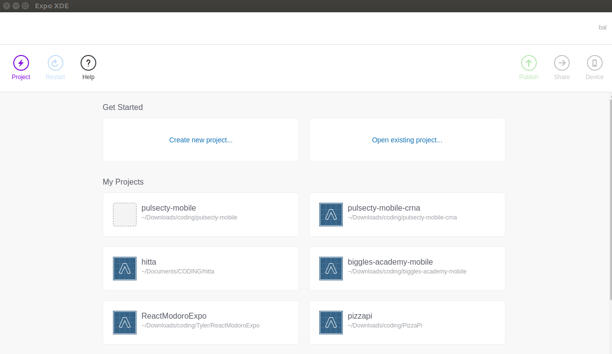
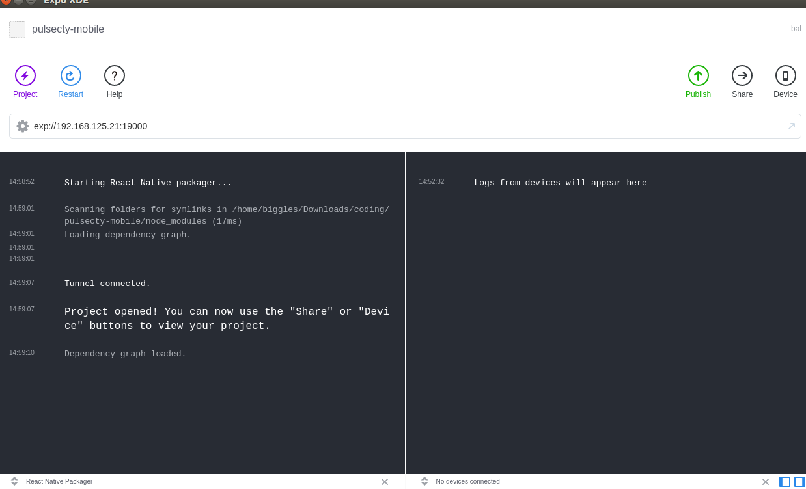
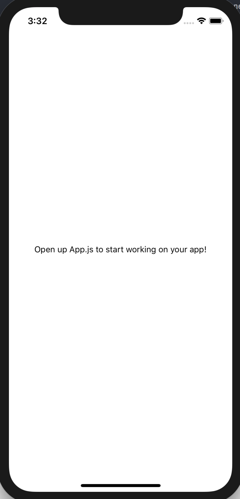
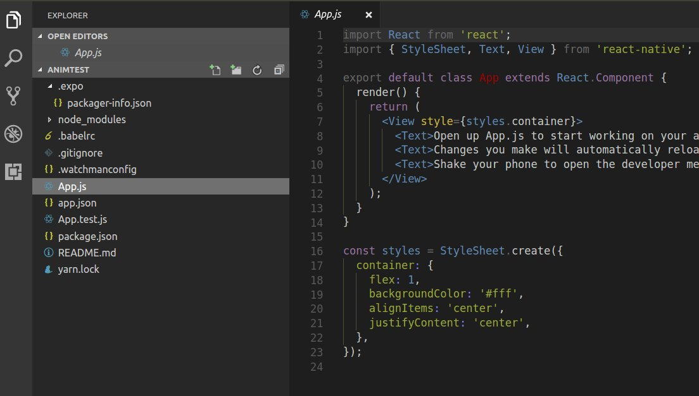
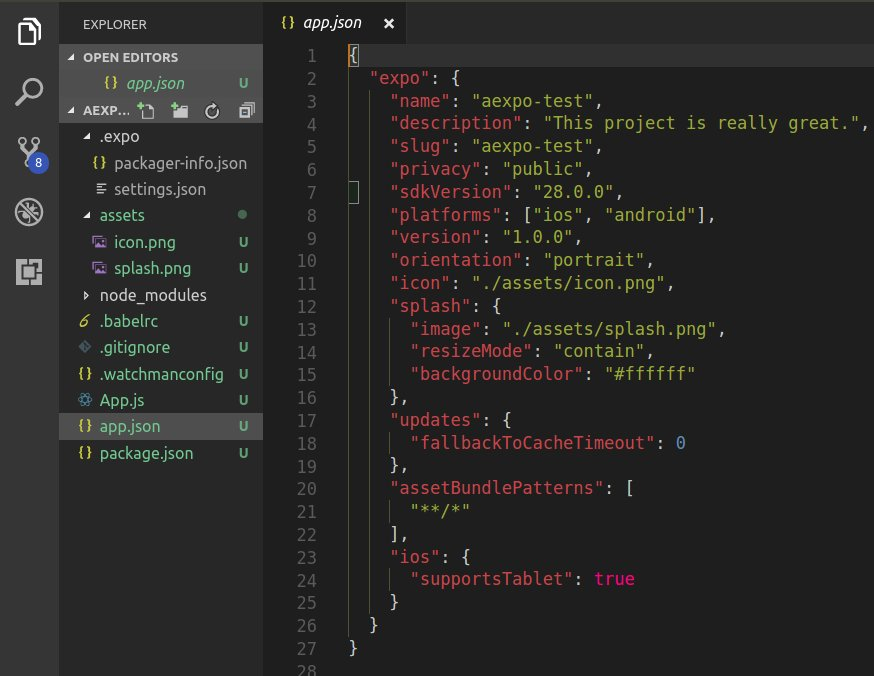

# Chapter 2 - Setup

### What are the various options available to start a new project?

- [Expo and create new project](https://docs.expo.io/versions/v28.0.0/workflow/up-and-running)
- [Create React Native App](https://github.com/react-community/create-react-native-app#installation)
- [Project with native code](https://facebook.github.io/react-native/docs/getting-started#creating-a-new-application)
- [Expo Snack](https://expo.io/tools#snack) for quick testing
- or just use a [boilerplate](https://github.com/jondot/awesome-react-native#seeds)

### Expo walkthrough

**After launch**  

**After opening the project**

### Get basic text visible on screen, change text and see it reloading

### Folder structure - CRNA

### Folder structure - Expo

### Resources

- [Running on device](https://facebook.github.io/react-native/docs/running-on-device)
- [Hot Reloading](https://facebook.github.io/react-native/blog/2016/03/24/introducing-hot-reloading.html#hot-reloading) on React Native blog
- [Hot Reloading](https://www.youtube.com/watch?v=2uQzVi-KFuc&feature=youtu.be) video
- [What is the difference between Hot Reloading and Live Reloading in React Native?](https://stackoverflow.com/questions/41428954/what-is-the-difference-between-hot-reloading-and-live-reloading-in-react-native)
- [Configuration with app.json](https://docs.expo.io/versions/latest/workflow/configuration)
