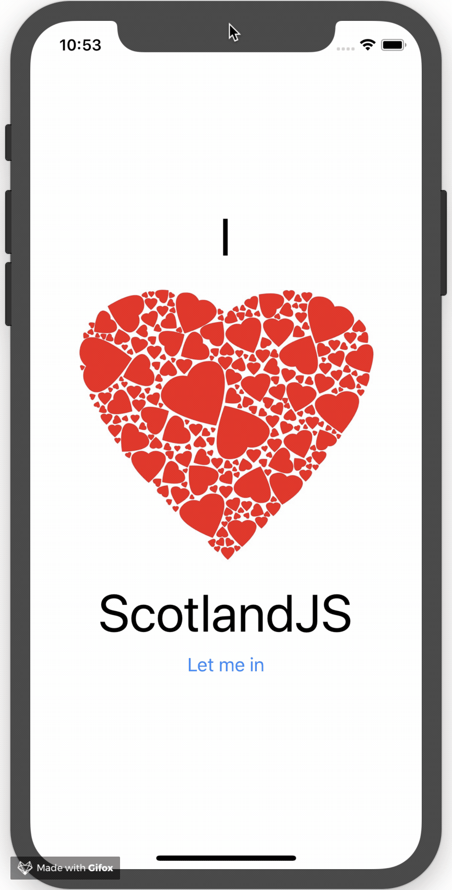

# Chapter 3 - Basic React Native Components

This is what we are trying to build now:



Those are the components that we will use:

1.  [View](https://facebook.github.io/react-native/docs/view)
2.  [Text](https://facebook.github.io/react-native/docs/text)
3.  [Image](https://facebook.github.io/react-native/docs/image)
4.  [Button](https://facebook.github.io/react-native/docs/button)
5.  [Alert](https://facebook.github.io/react-native/docs/alert)

Components in React Native - custom components - wrapper around Text.


> **RN Wisdom**: Just wrap components straight away when you start a project. Don't use `<Text>` directly, have your own `<AppText>` or similar. You will come to need it.

```js
class AppText extends Component {
  render() {
    return (
        <Text style={{fontSize: 20}}>{this.props.children}</Text>
    );
  }
}

// Then use somewhere in the app
<AppText>Hello</AppText>
```

> **RN Wisdom**: Use a `scale` function to have relative widths and heights. It will save you a lot of headache with layout issues (especially on android)

```js
import { Dimensions } from 'react-native'
const { width, height } = Dimensions.get('window')

// Guideline sizes are based on standard ~5" screen mobile device
const guidelineBaseWidth = 350
const guidelineBaseHeight = 680

const scale = size => width / guidelineBaseWidth * size


// then in a style
container: {
  height: scale(200),
  margin: scale(10)
}
```

### Resources
