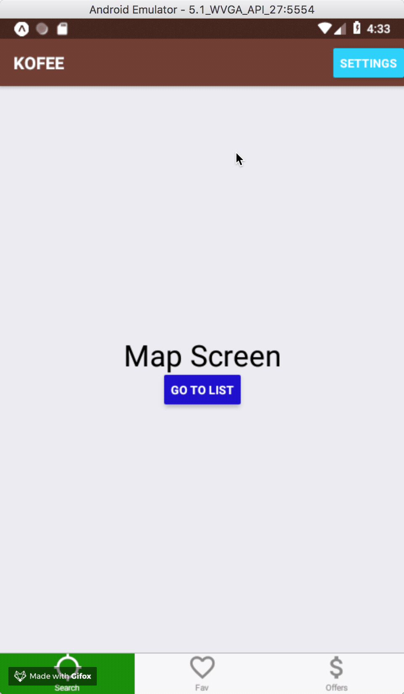

# Chapter 6 - Navigation

### What are the navigation options available in React Native?

- [React Navigation](https://reactnavigation.org/) - a JavaScript solution that is a good starting point with Stack and Tab Navigator.
- [React Native Navigation](https://github.com/wix/react-native-navigation) - currently working on v2.
- [Native Navigation](http://airbnb.io/native-navigation/) - native solution, but not production ready yet.
- [NavigatorIOS](https://facebook.github.io/react-native/docs/navigation#navigatorios) - for iOS only.
- [React Router Native](https://github.com/ReactTraining/react-router/tree/master/packages/react-router-native)

We are going to use **[React Navigation.](https://reactnavigation.org/)** Check this [Pitch & Anti-pitch](https://reactnavigation.org/docs/en/pitch.html) page for the pros and cons.

Here are the [installation instructions.](https://reactnavigation.org/docs/en/getting-started.html#installation)

### Basic Stack Navigator

We are going to use [createStackNavigator](https://reactnavigation.org/docs/en/stack-navigator.html).

```js
createStackNavigator(RouteConfigs, StackNavigatorConfig);
```

Here is the basic Root component:

```js
import React from "react";
import { createStackNavigator } from "react-navigation";
import HomeScreen from "./screens/HomeScreen";
import MapScreen from "./screens/MapScreen";
import ListScreen from "./screens/ListScreen";

const Root = createStackNavigator({
  Home: HomeScreen,
  List: ListScreen,
  Map: MapScreen
});

export default Root;
```

Now let's create our HomeScreen

```js
import React from "react";
import { StyleSheet, Text, View, Button } from "react-native";

export default class HomeScreen extends React.Component {
  render() {
    return (
      <View style={styles.container}>
        <Text style={styles.text}>Home</Text>

        <Button
          title="Go to Map"
          onPress={() => this.props.navigation.navigate("Map")}
        />
        <Button
          title="Go to List"
          onPress={() => this.props.navigation.navigate("List")}
        />
      </View>
    );
  }
}

const styles = StyleSheet.create({
  container: {
    flex: 1,
    backgroundColor: "#f8f8f8",
    alignItems: "center",
    justifyContent: "space-around"
  },
  text: {
    fontSize: 26
  }
});
```

Let's check out this [navigation props:](https://reactnavigation.org/docs/en/navigation-prop.html)

```js
console.log(this.props);
```

In a similar fashion we create two other screens: ListScreen & MapScreen, but this time with a button pointing back to HomeScreen, something like this:

```js
import React from "react";
import { StyleSheet, Text, View, Button } from "react-native";

export default class ListScreen extends React.Component {
  render() {
    return (
      <View style={styles.container}>
        <Text
          style={{
            fontSize: 26
          }}
        >
          List Screen
        </Text>
        <Button
          title="Go Home"
          onPress={() => console.log(this.props.navigation.navigate("Home"))}
        />
      </View>
    );
  }
}

const styles = StyleSheet.create({
  container: {
    flex: 1,
    backgroundColor: "#f8f8f8",
    alignItems: "center",
    justifyContent: "space-around"
  }
});
```

What happens if we want to set up a **default screen** at the startup time? We can use the optional **StackNavigatorConfig** object:

```js
{
    initialRouteName: 'Home',
}
```

Notice that we now have an empty header. What we want is to **add route name to the header** on List and Map screen, but hide the header on the Home screen. So let's start with adding ANYTHING to the header:

```js
navigationOptions: {
  title: "ScotlandJS";
}
```

But this renders the same header on every route, so we want to customise per screen:

```js
navigationOptions: {
  title: "MAP";
}
```

and

```js
navigationOptions: {
  title: "LIST";
}
```

And finally we want to hide header on Home screen:

```js
navigationOptions: {
  header: null;
}
```

Ok, how about if we want to **pass data to the screen**? How do we do that? We can [supply params object](https://reactnavigation.org/docs/en/navigation-prop.html#navigate-link-to-other-screens) to navigate function:

```js
<Button
  title="Go to Map"
  onPress={() => this.props.navigation.navigate("Map", { name: "Michael" })}
/>
```

And then we can retrive it inside of the screen in two ways:

```
static navigationOptions = ({ navigation }) => {
  return {
    title: navigation.state.params.name
  };
};
```

or

```
static navigationOptions = ({ navigation }) => {
  return {
    title: navigation.getParam("name")
  };
};
```

But this will be useful for creating a cutom header. Can we also used the passed data inside of the screen itself?
Yes, this is left as an exercise :-)

Ok, next we would like to [**style our headers**](https://reactnavigation.org/docs/en/headers.html#adjusting-header-styles). How do we do that?

```js
navigationOptions: {
  headerStyle: {
    backgroundColor: "#f4511e"
  },
  headerTintColor: "#fff",
  headerTitleStyle: {
    fontWeight: "bold"
  }
}
```

Can we render a [**component inside the header**](https://reactnavigation.org/docs/en/headers.html#replacing-the-title-with-a-custom-component)? Sure!

```js
const Header = props => {
  return <Text>{props.title}</Text>;
};
```

and this time we need to use **headerTitle** instead of **title** property inside the navigationOptions:

```js
static navigationOptions = {
  headerTitle: <Header title="The List" />,
  headerStyle: {
    backgroundColor: "steelblue"
  },
  headerTintColor: "#f8f"
};
```

How about if we want to [render a button on the right hand side](https://reactnavigation.org/docs/en/header-buttons.html)?

```js
static navigationOptions = {
    headerTitle: <LogoTitle />,
    headerRight: (
      <Button
        onPress={() => alert('This is a button!')}
        title="Info"
        color="#fff"
      />
    ),
};
```

So how does the navigation props work? When do we have [access](https://reactnavigation.org/docs/en/connecting-navigation-prop.html) to them?

Basically **this.props** is only available inside the screens. If you want to have access to navigation props inside any component, then you have two options:

1.  Pass navigation props to the component
    ```js
    <MyBackButton navigation={this.props.navigation} />
    ```
2.  Use Higher Order Component

    ```js
    import { withNavigation } from "react-navigation";

    class MyBackButton extends React.Component {
      render() {
        return (
          <Button
            title="Back"
            onPress={() => {
              this.props.navigation.goBack();
            }}
          />
        );
      }
    }

    export default withNavigation(MyBackButton);
    ```

Are there any **other navigators** available?

1.  [SwitchNavigator](https://reactnavigation.org/docs/en/switch-navigator.html)
2.  [TabNavigator](https://reactnavigation.org/docs/en/tab-navigator.html)
3.  [BottomTabNavigator](https://reactnavigation.org/docs/en/bottom-tab-navigator.html)
4.  [MaterialBottomTabNavigator](https://reactnavigation.org/docs/en/material-bottom-tab-navigator.html)
5.  [MaterialTopTabNavigator](https://reactnavigation.org/docs/en/material-top-tab-navigator.html)

Is it possible to **compose navigators**? 



You can also check out the [example repo.](https://github.com/Michael-Antczak/ScotlandJS-composed-navigation-example)

### Resources

- [Navigating Between Screens](https://facebook.github.io/react-native/docs/navigation) in React Native docs.
- [Routing & Navigation](https://docs.expo.io/versions/v28.0.0/guides/routing-and-navigation) in Expo docs.
