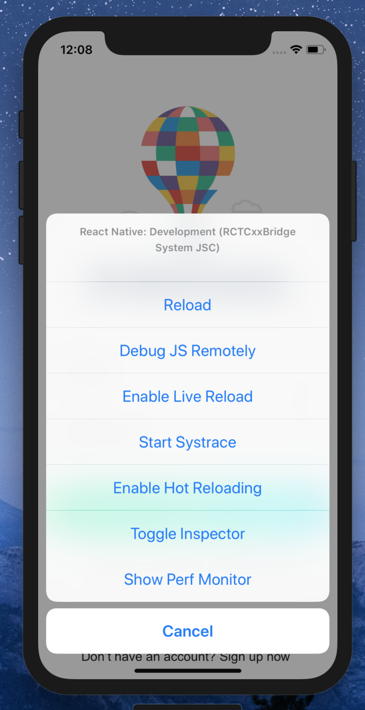
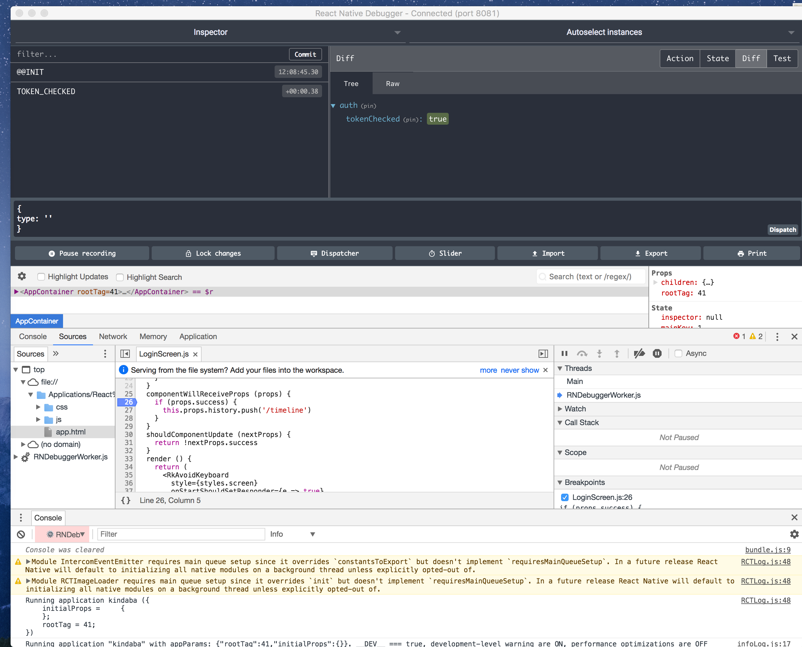

# Chapter 7 - Debugging

## Console.log and warn

There is an argument that this fits the fast development philosophy of RN to develop fast and get immediate feedback so don't shy away from console.`log` and `warn` .. use them!

## React Native Standalone debugger

[React Native Debugger](https://github.com/jhen0409/react-native-debugger) is a standalone electron app for debugging React Native apps. This uses the familiar Chrome DeV tools

> To get the Debugger listening to the default Expo port, run this command `open 'rndebugger://set-debugger-loc?host=localhost&port=19001'`

- Although source mapping is generally reliable, it still has issues with `async/await`, you might need to use the `debugger` keyword in your code to get the breakpoints to stop where you expect them.
- Enabling Network inspection considerably slows the the debugger
- Install Redux DevTools - if your app is using Redux, it's a great way to debug (and also reverse-engineer) code

> **RN Wisdom**: Optimsations - Use the memory and CPU profilers of RN Debugger to identify bottlenecks and unexpected behaviour in your code. You'd be surprised about what you find!

## Resources

- [Debugging](https://facebook.github.io/react-native/docs/debugging) in React Native docs.
- [Debugging](https://docs.expo.io/versions/v28.0.0/workflow/debugging) in Expo docs.
- [Debugging React Native Applications](https://medium.com/reactnativeacademy/debugging-react-native-applications-6bff3f28c375) by Dotan Nahum
